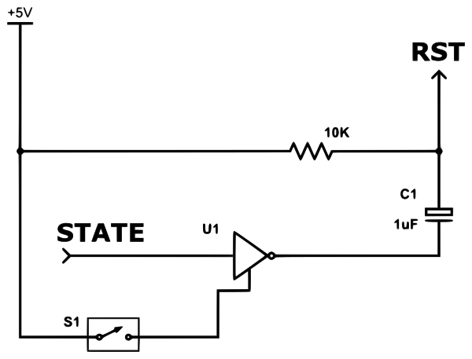

## Arduator
**A Firmware (.hex) Uploader for Arduino using Bluetooth 2.0 or 4.0LE (BLE).**

Use Arduator to upload a .hex file produced by the Arduino compiler to a properly equipped **Arduino Nano or Uno** device.

In App help documentation explains how to build a programming circuit and setup/connect the Arduino, bluetooth module, and programming circuit.

**Only Arduino Nano and Uno are currently supported. A programming circuit is required.**

### Like the code? Want to encourage and support the developer? Buy the App; only $0.99!

### The Programming Circuit

In this diagram, STATE is an output from the Bluetooth module and RST is connected to the Arduino RST pin input.

A switch is used to provide power to an Inverter logic gate. When the switch is ON and a connection is established to the Bluetooth module, the capacitor discharges pulling the RST pin to LOW temporarily. This causes the Arduino to reset and accept bootloader commands.

There are programming circuit designs provided by others online. Any similar working design will function with Arduator.

### Brought to You By

